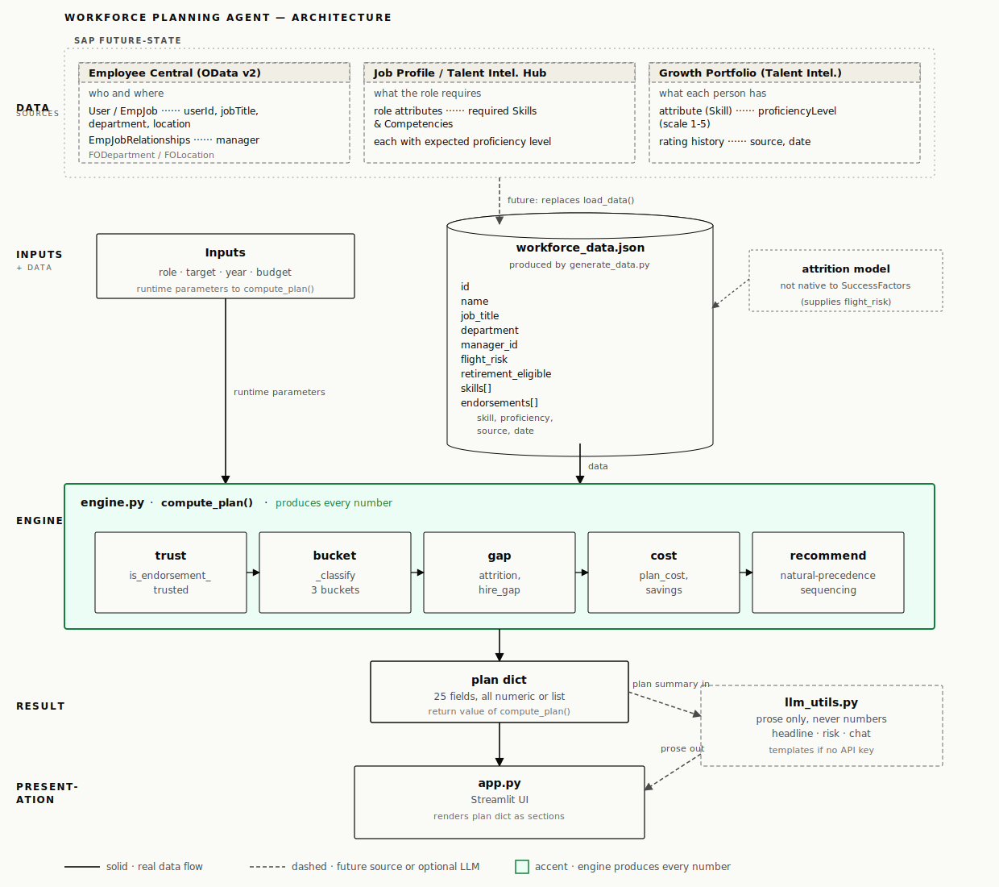

# Workforce Planning Agent

Turn a workforce target into a costed, explainable plan to **move, reskill, verify, or hire**.

[Open the live demo →](https://workforce-planning-agent.streamlit.app/)

The app is a single executive briefing: choose a role, target, deadline, and budget, then see the available internal supply, hiring gap, expected cost, savings, timeline, and data-quality risks. It runs on synthetic data and does not require an API key.

## The problem

Workforce planning often starts with a simple question:

> We need 250 AI Engineers by Q4 2027. What is the fastest, most defensible way to get there within budget?

The answer is usually spread across HRIS headcount, skill records, learning history, recruiting benchmarks, and spreadsheets. This prototype joins those signals into one decision view and makes the assumptions visible.

It answers:

- Who is already qualified and in role?
- Who is qualified but working elsewhere?
- Who is one course away?
- Whose skill record needs verification?
- How many external hires remain after internal options?
- What will the plan cost compared with hiring everyone?
- Which numbers are firm, and which depend on uncertain data?

## What makes it different

### Numbers are deterministic

Every count and dollar amount comes from `engine.py`. The same data and inputs always produce the same plan.

### AI is optional and never does the math

The LLM is limited to presentation: headline copy, risk prose, and chat responses. Without an OpenAI key, deterministic templates take over and the calculations remain unchanged.

### Uncertainty stays visible

Self-declared, inferred, or stale skill evidence is not silently treated as fact. Those employees enter a separate **needs verification** bucket so the user can see where manager review could change the plan.

### Capability matters more than title

An employee can count as qualified supply even when their current title differs from the target role. This makes internal mobility explicit before external hiring begins.

## How the plan is built

Each employee is evaluated against four required skills for the selected role:

1. **Confirmed** — every required skill is proficiency 3+ and supported by a recent manager endorsement or course completion.
2. **One course away** — exactly one required skill is missing; all others are confirmed.
3. **Needs verification** — the required skills appear in the record, but at least one relies only on weak or stale evidence.
4. **Not counted** — two or more required skills are missing.

The engine then:

1. separates confirmed employees already in role from movable employees in other teams;
2. estimates one-year attrition across confirmed supply;
3. applies internal moves and reskilling before external hiring;
4. calculates the remaining hire gap;
5. compares the plan cost with an all-external-hiring baseline; and
6. surfaces budget shortfalls, timing assumptions, and data-quality risk.

Current benchmark assumptions:

- Internal move: **$6,000** and approximately **2 months**
- Reskill: **$8,000** and approximately **4 months**
- Verification: **$0** and approximately **1 month**
- External hire: **$45,000** and approximately **6 months**
- Missing flight-risk value: **15%**

These are prototype defaults, not universal benchmarks. In production they would be configurable or sourced from finance and HR systems.

## Architecture



- **`app.py`** — Streamlit interface and executive briefing
- **`engine.py`** — deterministic classification, gap, cost, attrition, and action logic
- **`llm_utils.py`** — optional OpenAI prose with offline fallbacks
- **`generate_data.py`** — reproducible synthetic workforce generator
- **`workforce_data.json`** — bundled 200-person synthetic dataset

The intended production boundary is straightforward: replace the JSON loader with HRIS, skills, learning, and finance integrations while leaving the planning engine and presentation contract intact.

## Synthetic data by design

The bundled dataset is deterministic (`seed = 42`) but deliberately imperfect:

- 200 employees across five technical roles
- self-declared and inferred endorsements
- stale and duplicate skill evidence
- missing flight-risk values
- cross-trained employees qualified for roles outside their current team

The messiness is intentional. A perfectly clean dataset would hide the trust and verification problems this prototype is designed to expose.

All names and workforce records are synthetic.

## Run locally

Requires Python 3.11+.

```bash
git clone https://github.com/lassoregression/workforce-planning-agent.git
cd workforce-planning-agent

python -m venv .venv
source .venv/bin/activate
pip install -r requirements.txt

streamlit run app.py
```

`workforce_data.json` is already included. To regenerate it deterministically:

```bash
python generate_data.py
```

## Optional LLM features

The app works fully offline. To enable generated headlines, risk summaries, and chat responses:

```bash
cp .env.example .env
```

Then add:

```text
OPENAI_API_KEY=your_key_here
OPENAI_MODEL=gpt-4o-mini
```

No model output is used in workforce classification, headcount math, cost calculations, or savings.

## Prototype scope

This is a decision-support prototype, not a production workforce system.

Known limits:

- one role is planned at a time;
- employees may appear qualified for more than one role across separate scenarios;
- action costs and timelines are fixed benchmarks;
- flight-risk values are synthetic estimates;
- scenarios are not persisted or compared over time; and
- the chat is single-turn and grounded only in the current plan.

## Roadmap

The highest-value next steps are:

1. connect SuccessFactors or another HRIS through supported APIs;
2. show endorsement provenance for every employee and skill;
3. source role-specific costs and timelines from finance and recruiting;
4. support simultaneous multi-role allocation without double-counting people;
5. save scenarios and compare plans over time; and
6. connect course recommendations to a learning catalog.

## License

MIT © 2026 Mujeeb Khan ([lassoregression](https://github.com/lassoregression)). See [LICENSE](LICENSE).
